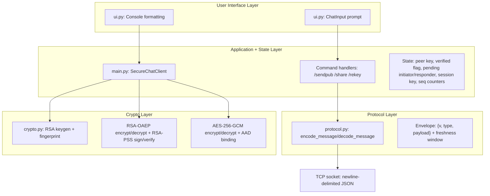
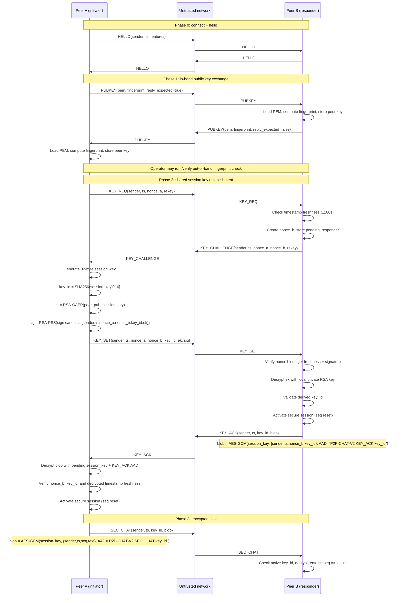
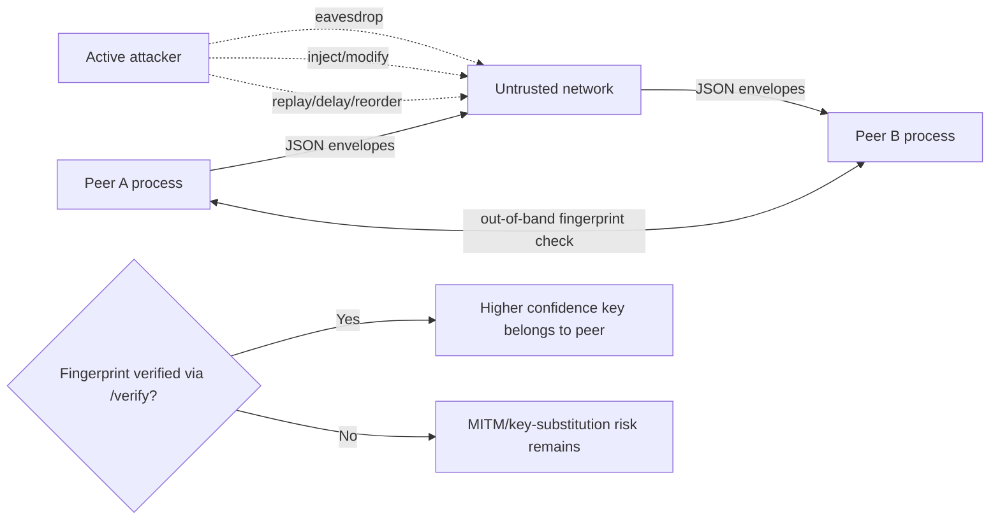
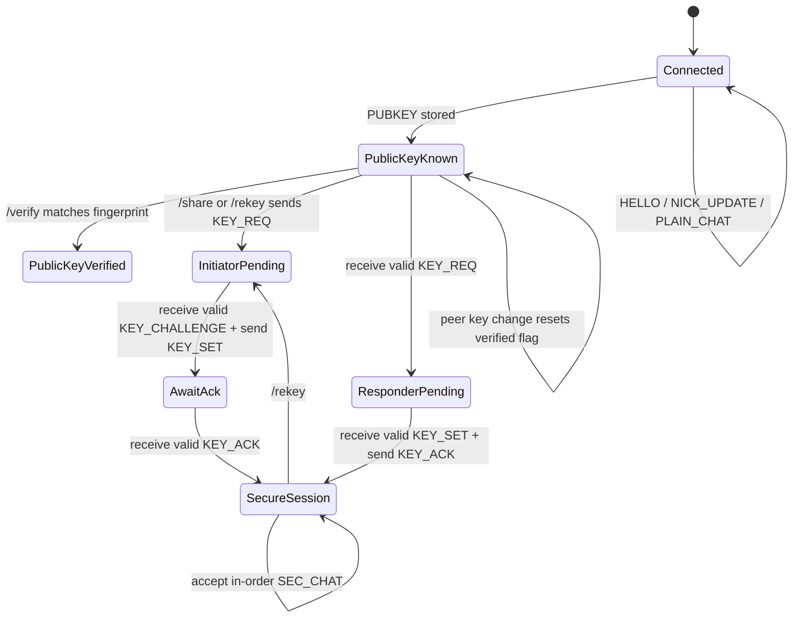
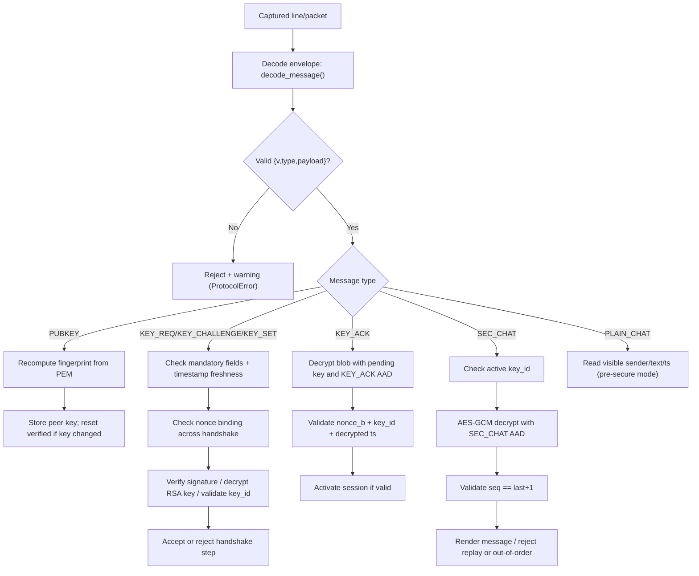

# Encrypted Peer-to-Peer Chat System: Visual + First-Principles Report

## 1) What the system is trying to guarantee (from first principles)

A secure chat system is not just “encrypt text.” It must answer four practical questions:

1. **Who am I talking to?** (authentication / identity confidence)
2. **How do we agree on one secret key safely?** (key distribution)
3. **Can an attacker tamper with messages?** (integrity)
4. **Can old packets be replayed to confuse the session?** (freshness)

This project solves those with explicit protocol steps in `Code/main.py`, using:
- **RSA-2048 + OAEP** for key transport,
- **RSA-PSS** for signature-based key-authentication,
- **AES-256-GCM** for authenticated encryption,
- **nonce + timestamp + sequence checks** for replay resistance.

---

## 2) Layered architecture (what runs where)

**Runtime model:** one main thread handles input/sending, while a receiver thread
decodes incoming lines and dispatches handlers. Shared state is guarded by locks.

---

## 3) Full protocol sequence (public keys + shared key + secure chat)

### Why this sequence works

- **Authentication of key material:** `KEY_SET` is signed by the initiator’s RSA private key, so the responder can verify who authorized the transported key.
- **Confidential key transport:** `ek` is encrypted with responder’s public key, so only responder can recover the session key.
- **Key confirmation:** `KEY_ACK` proves responder could decrypt and use the same key.
- **Context binding:** AAD includes message purpose (`KEY_ACK` vs `SEC_CHAT`) and `key_id`, preventing cross-use of ciphertext.

---

## 4) Trust and threat model visualization

### Security objective mapping

- **Confidentiality:** AES-GCM protects `SEC_CHAT` payload text.
- **Integrity:** GCM tags + RSA signature checks reject modified payloads.
- **Authentication:** signature verification + fingerprint verification process.
- **Freshness:** timestamps for handshake and monotonic `seq` for secure chat.

---

## 5) Lifecycle and state machine

Implementation-aligned details:
- `pending_initiator` and `pending_responder` hold nonce context.
- `_activate_session(...)` installs key, sets `session_established=True`, resets send/recv sequence counters, and clears pending handshake state.
- Secure receive path rejects stale key IDs, replayed sequences, and out-of-order sequences.

---

## 6) Packet evidence and validation workflow

### What packet evidence should show

1. **Before `/share`:** `PLAIN_CHAT` text readable in capture.
2. **During handshake:** visible metadata for `PUBKEY`, `KEY_REQ`, `KEY_CHALLENGE`, `KEY_SET`, `KEY_ACK`.
3. **After session activation:** `SEC_CHAT.blob` visible as base64 ciphertext, not readable plaintext.
4. **Negative tests:** replayed `SEC_CHAT` or stale handshake timestamps are logged and ignored.

---

## 7) Principle-driven explanation of core controls

| Principle | How this implementation enforces it |
|---|---|
| Authentication | RSA-PSS signature on canonical `KEY_SET` payload; optional operator fingerprint verification via `/verify`. |
| Key distribution | Initiator generates random 32-byte key, wraps with responder public RSA key (`ek`) and signs the context. |
| Trust establishment | Fingerprints are computed from PEM locally and can be verified out-of-band; trust is explicit, not assumed. |
| Freshness | Handshake timestamps checked with bounded skew (`MAX_CLOCK_SKEW_SECONDS = 180`), plus nonces and strict secure-message sequence counters. |
| Integrity + context binding | AES-GCM tags and AAD domain separation (`P2P-CHAT-V2|PURPOSE|key_id`) prevent undetected tampering and cross-context replay. |

### Added commands (aligned with reference implementation)

| Command | Description |
|---|---|
| `/showkeys` (updated) | Displays full PEM of local and peer public keys, plus fingerprints. Previously showed fingerprints only. |
| `/showsession` | Shows detailed handshake state: session key presence, handshake role (A initiator / B responder), pending nonce state, and send/recv sequence counters. Parallel to the reference implementation's `/showsession`. |
| `/status` (updated) | Now includes `Messages sent: N \| received: N` counters tracked across the session. |

---

## 8) Operational walkthrough aligned with implemented commands

1. Start peers:
   - `python3 Code/main.py listen 5000 --nick Alice`
   - `python3 Code/main.py connect 127.0.0.1 5000 --nick Bob`
2. Optional plaintext test: send a normal message before key sharing (`PLAIN_CHAT`).
3. Generate keys if not yet done: `/genkeys`.
4. Exchange public keys: `/sendpub` (peer auto-replies once).
5. Inspect keys and fingerprints: `/showkeys` — shows full PEM of both local and peer keys, plus their fingerprints.
6. Optionally verify peer fingerprint out-of-band: `/verify <fingerprint>`.
7. Start secure setup: `/share` — triggers `KEY_REQ` → `KEY_CHALLENGE` → `KEY_SET` → `KEY_ACK`.
8. Send normal text again; it now goes as encrypted `SEC_CHAT` once session is active.
9. Inspect detailed session state: `/showsession` — shows key presence, handshake role (A/B), and sequence counters.
10. Check message counters and overall state: `/status` — shows `Sent: N | Received: N` along with session summary.
11. Rotate session key at any time: `/rekey`.
12. Use `/history` to review past messages; exit with `/quit`.

---

## 9) Current limits and realistic next steps

- Identity proof is still operator-dependent unless fingerprints are verified out-of-band.
- RSA key transport does not provide forward secrecy if long-term keys are later compromised.
- Freshness depends partly on endpoint clocks for handshake timestamp checks.

High-value improvements:
1. Move to authenticated ephemeral key agreement for forward secrecy.
2. Add persisted trust-on-first-use or certificate-backed identity.
3. Add structured audit logs for accepted/rejected security events.
